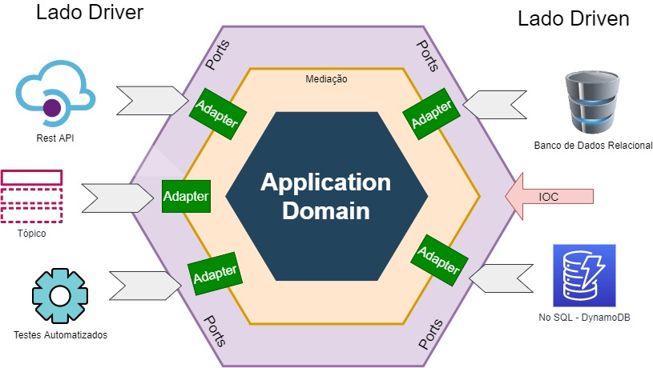

# POC Arquitetura Hexagonal / Ports and Adapters
Projeto de prova de conceito de Arquitetura Hexagonal escrito em java

**Arquitetura Hexagonal** é um padrão arquitetural que consiste em regras e princípios para definir a organização estrutural dos componentes do software, seus relacionamentos e suas interfaces externas. Estabelece uma arquitetura **moderna, robusta e altamente flexível**, orientadas pelas premissas básicas da filosofia de desenvolvimento ágil como **TDD, foco nos requisitos de negócio e independência técnica e de infra estrutura**.

A solução baseada na arquitetura hexagonal, permite que o software seja executado igualmente por usuários, programas, testes automatizados, e que seja desenvolvido e testado isoladamente de seus dispositivos externos, fazendo com que a equipe de desenvolvimento foque no desenvolvimento do **requisito de negócio**, diminuindo dependências externas técnicas e de infra estrutura.

A arquitetura hexagonal aplica **SoC(Separation of Concerns)** e estabelece o princípio de **modularizar** a solução em 3 áreas distintas e isoladas:
1. Centro como hexágono.
2. Lado esquerdo, fora do hexágono.
3. Lado direito, fora do hexágono.

**Centro do Hexágono** temos as entidades de domínio que são importantes para o problema de negócio. É a parte mais importante do sistema e conterá o código que abstrai as regras de negócio do mundo real em modelo de objetos. Esta parte fica isolada de todas as outras partes, não tendo dependência nenhuma delas. O centro do Hexágono deve ser totalmente agnóstico de tecnologia, framework, infra estrutura, interface gráfica, comunicações e dispositivos externos.

**Lado esquerdo**, conterá código de tecnologia específica, que irá disparar eventos na solução, como uma api, ou um evento percebido em um tópico.

**Lado direito**, fornecerá os serviços de infraestrutura. Conterá código de tecnologia específica, como banco de dados, geração de arquivos, produção de eventos e mensagens.

**Lado esquerdo fora do hexágono** estão os atores primários condutores (Drivers). É aquele que interage com a aplicação com um objetivo. Ex: Chamada de API, HTTP Request, Teste Automatizados

**Lado Direito fora do hexágono** estão os adores secundários conduzidos (Driven). Neste caso interação é acionada pelo hexágono para o ator secundário que fornece funcionalidades necessárias ao hexágono para cumprir o seu objetivo. Ex: Banco de dados relacionais, No SQL, chamada de webservice, produção de evento em tópico.

A **Arquitetura Hexagonal** estabelece o seguinte princípio de dependências: **"SOMENTE DE FORA PARA DENTRO!"**
Lado esquerdo depende do hexágono. Lado direito depende do hexágono. O Centro do hexágono não depende de ninguém, somente dele mesmo. Sendo assim o lado esquerdo e o direito se torna flexível e intercambiável e dependente do centro.

## Portas

**A comunicação com o hexágono de fora para dentro deve ser através de Portas**.
As portas são utilizadas por meio de **interfaces**, utilizando a técnica de polimorfismo da orientação a objetos. Portanto tempos portas de condutores e portas de conduzidos.
Essas interfaces atuam como isoladores explícitos do centro do hexágono, atingindo o objetivo da visão hexagonal que é ter o "core", totalmente isolado independente das tecnologias de entrada e saída e podendo ser orientado a TDD.

## Adaptadores

É o componente que **permite que uma tecnologia externa interaja com uma porta do hexágono**. Deve haver um adaptador para cada tecnologia que deseja usar. O adaptador implementa a interface fornecida pela porta para determinada tecnologia.
Adaptador Condutor converte uma solicitação de tecnologia específica para uma porta genérica condutora, trazendo dados externos para dentro da solução. Responsável por fazer integração do lado externo para o lado interno do hexágono. Alguns exemplos: Restful APIs, Consumer de tópico.
Adaptador Conduzido converte uma chamada de dentro para fora, usando serviços externos da solução. Alguns exemplos: JPA Adatpter, Topic Producer.

## Inversão de Controle

Para inverter a dependência do hexágono para o lado direito, seguindo a regra citada anteriormente, a arquitetura hexagonal aplica o **IOC, estabelecendo o princípio modular que o lado de fora direito tenha dependência com o hexágono**.

## Quando utilizar a Arquitetura Hexagonal?
Não existe solução padrão de arquitetura que é indicado para todos os problemas, mas a arquitetura hexagonal se torna uma opção muito interessante para projetos de **médio e grande porte** que possuem **longo ciclo de vida e precisam ser modificados, ou por evolução, ou por alteração de escopo e de regras de negócios**. O tempo maior gasto inicialmente para estruturar o projeto para a arquitetura hexagonal trará ganhos futuros em termos de tempo de manutenção, inclusão de novas capacidades e independência dos módulos. Um ganho bastante interessante da prática desta arquitetura é que ela permite que **diferentes times podem trabalhar em módulos diferentes no mesmo projeto**, sendo que um não impacta o outro. Como o versionamento dos módulos é independente e é possível simular os outros módulos através de mocks, auxilia e muito no desenvolvimento paralelo.